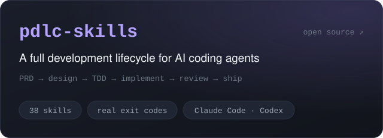
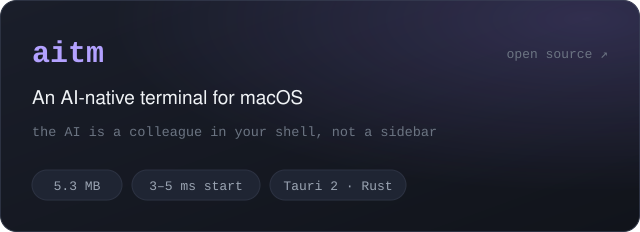

  

  <b>用 AI 写真实项目，把踩过的坑做成工具。</b>

  
  

  <b>pdlc-skills</b>：给 AI 编程工具装上完整的开发流程，每一步检查只认命令的真实退出码 
  <b>aitm</b>：macOS 上的 AI 原生终端，AI 是终端里的同事，不是侧边栏

 

  
  
  
  
  

  中文长文首发在公众号「码上驰骋」，英文在 dev.to，日文在 Zenn · 二维码和全部入口见 <a href="https://kanfu-panda.github.io/zh/follow/">关注页</a>

